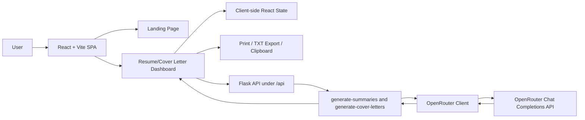

# 🚀 ResumeGen AI

### Build Professional Resumes & Cover Letters with AI

ResumeGen AI is an AI-powered resume and cover letter builder that helps job seekers create ATS-friendly, professional documents in minutes.

Generate compelling resume summaries, craft tailored cover letters, choose from multiple modern templates, and export ready-to-use documents—all from a clean and intuitive interface.

---

## ✨ Why ResumeGen AI?

Writing resumes and cover letters is time-consuming and often frustrating.

ResumeGen AI simplifies the process by combining:

- ✅ AI-generated content suggestions
- ✅ Professional templates
- ✅ Real-time document preview
- ✅ Resume & Cover Letter workflows
- ✅ One-click export options

---

## 🎯 Key Features

### 📄 Resume Builder

- Dynamic resume creation
- Real-time editing and preview
- ATS-friendly formatting
- Multiple resume templates:
  - Classic
  - Modern
  - Creative

### 📝 Cover Letter Generator

- Generate personalized cover letters
- AI-powered content suggestions
- Professional templates
- Live preview while editing

### 🤖 AI Assistance

Powered by OpenRouter AI integration to:

- Generate professional resume summaries
- Create tailored cover letter content
- Improve resume quality and readability

### 🎨 Customization

- Template switching
- Theme customization
- Accent color selection
- Responsive design

### 📥 Export Options

- Print-ready documents
- TXT export
- Copy-to-clipboard support

---

## 🖼️ Application Preview

### Landing Page


### Resume Builder


### Cover Letter Builder


---


## 🛠️ Tech Stack

### Frontend

- React 19
- Vite
- React Router DOM
- Tailwind CSS
- Framer Motion
- Lottie React

### Backend

- Python
- Flask
- Flask-CORS
- Requests

### AI

- OpenRouter API
- GPT-4o Mini

---

## 🏗️ Architecture

```text
User
  ↓
React Frontend
  ↓
Flask API
  ↓
OpenRouter API
  ↓
AI Generated Content
```

---

## System Architecture Overview



---

## 📂 Project Structure

```text
ResumeGen-AI
│
├── Backend-main
│   ├── app
│   │   ├── routes.py
│   │   ├── openrouter_client.py
│   │   └── __init__.py
│   ├── requirements.txt
│   └── run.py
│
├── Frontend-main
│   ├── src
│   │   ├── assets
│   │   ├── components
│   │   ├── resume
│   │   └── sections
│   ├── package.json
│   └── vite.config.js
│
└── README.md
```

---

## 🚀 Getting Started

### Clone Repository

```bash
git clone https://github.com/Shreya04-bot/ResumeGen-AI.git
cd ResumeGen-AI
```

### Install Frontend

```bash
cd Frontend-main
npm install
```

### Install Backend

```bash
cd Backend-main
pip install -r requirements.txt
```

### Configure Environment Variables

Backend `.env`

```env
OPENROUTER_API_KEY=your_api_key
PORT=8000
FRONTEND_URL=http://localhost:5173
```

Frontend `.env`

```env
VITE_API_URL=http://localhost:8000/api
```

### Run Backend

```bash
python run.py
```

### Run Frontend

```bash
npm run dev
```

---

## 🌟 Future Enhancements

- User Authentication
- Resume History & Cloud Storage
- DOCX Export Support
- ATS Score Analyzer
- Interview Preparation Assistant
- LinkedIn Profile Optimizer
- Resume Sharing Links

---

## 👩‍💻 Author

**Shreya Chauhan**

Computer Science Engineering Student  
Full Stack Developer | AI Enthusiast

- GitHub: https://github.com/Shreya04-bot

---

## ⭐ Support

If you found this project useful, please consider giving it a ⭐ on GitHub.

It helps support future development and motivates further improvements.